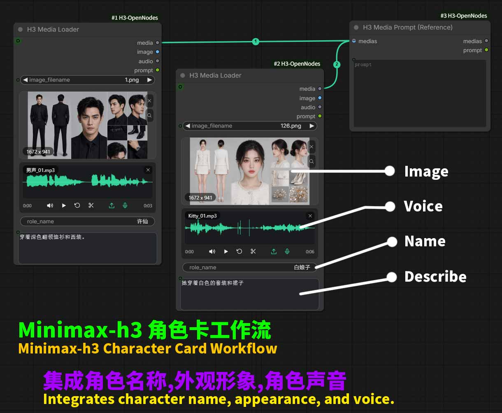
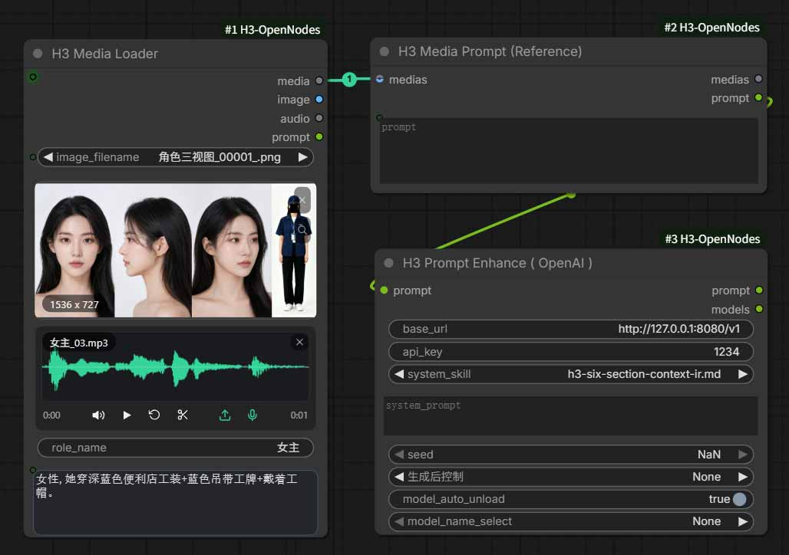

# ComfyUI-H3-OpenNodes  
### MiniMax-H3 角色卡 - 支持高低噪放大的视频生成的实用功能节点 !    
### MiniMax-H3 Character Card - A practical feature node supporting high and low noise amplification in video generation.    

  

--- 
### ✨ 最简单的使用场景 (The simplest use case):  
👉 当你定义了一个角色卡包括图像和声音,比如角色的名称叫:露西.  
那么你的提示词只需要写露西在做什么,例如:露西开心的说:"你好",  
该节点会自动绑定并关联到该角色卡和声音克隆.  

> 所以, 你不需要关心图片1,图片2, 应该直接用角色的名字 (Name), 比如: 露西.    

👉 Once you define a character card that includes an image and a voice, such as a character named Lucy, then your prompt only needs to describe what Lucy is doing,  
for example: Lucy happily says, "Hello."   
The node will automatically bind and associate with that character card and voice clone.

> Therefore, you don’t need to care about Picture 1 and Picture 2, you should directly use the name of the character, for example: Lucy.  
---  
### 👉 MiniMax H3 的提示词 (MiniMax H3 prompts):  
**全英文提示词**: 提示词可以使用全中文或任意语言编写, 但建议在下游接入 skill 对提示词增强并转换成全英文提示词,这样可以避免角色乱说话,胡言乱语发生. 可以使用 qewn3.8 或任意大语言模型进行提示词增强.    

**All-English Prompts:** The prompts can be written entirely in Chinese or any other language, but it is recommended to integrate a skill module downstream to enhance the prompts and convert them into English prompts. This can prevent characters from speaking incoherently or rambling. Qewn 3.8 or any large language model can be used for prompt enhancement.   

  

> skills\h3-six-section-context-ir.md  
支持 OpenAI 协议, 支持本地大模型例如: Ollama, llama.cpp, LM Studio 等自由接入.  
Supports OpenAI protocols, allowing free access to local large models such as Ollama, llama.cpp, LM Studio, etc.

---  

### 👉 示例工作流 (Example workflow):  

安装节点 (Installation Node): ComfyUI-H3-OpenNodes  

> ComfyUI-H3-OpenNodes\workflows\

---

🤗 为什么选择它?  Why choose it?    
- ✅集成式媒体加载器: 支持图像,声音,名字,描述.  
- ✅Integrated media loader: Supports images, sounds, names, and descriptions.  
- ✅全自动提示词组装: 自动分析媒体拼装提示词.  
- ✅Fully automatic prompt assembly: Automatically analyzes media and assembles prompts.  
- ✅支持高低噪双采样: 所有条件均支持高低采样.  
- ✅Supports high and low noise dual sampling: High and low sampling are supported under all conditions.  

--- 

🚀 什么是高低双采样? What is high-low dual sampling?    
- **低采样**: 可以使用 512 分辨率进行极速抽卡预览.  
- **Low sampling**: Allows for ultra-fast gacha previews using a 512 resolution.  
- **高采样**: 使用latent高分辨率放大生成清晰的最终视频.  
- **High sampling**: Uses latent high-resolution upsampling to generate a sharp final video.  

---  

> 部份节点功能来自 ComfyUI 官方节点, 部份节点参考了 ComfyUI-PainterNodes 的实现, 在此基础上扩展自己需要的功能.  
Some node functionalities are derived from the official ComfyUI nodes, Some nodes are based on the implementation of ComfyUI-PainterNodes, and additional features are added based on these functionalities.   

